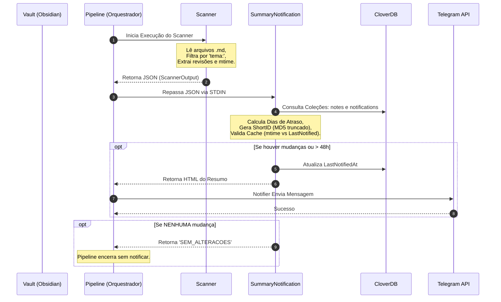
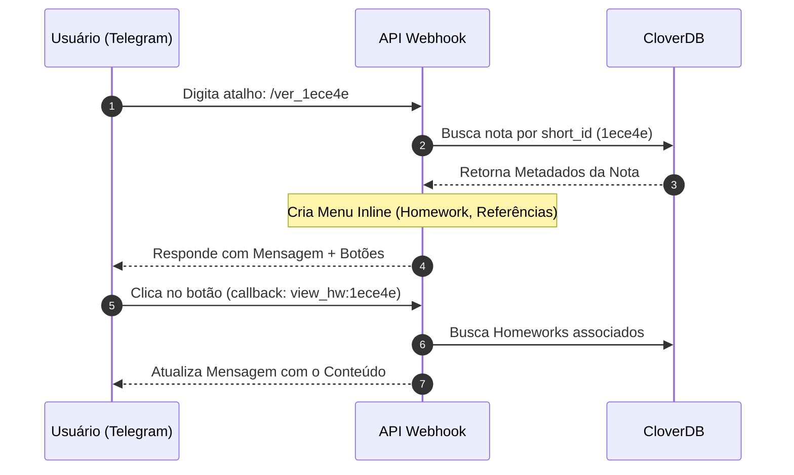

# Fluxo de Automação de Estudos (End-to-End)

Este documento atua como um guia de referência completo para o fluxo do **Study Manager** (Go). O fluxo envolve múltiplos processos de terminal que atuam como pipelines de dados (usando `stdin` e `stdout`), além de uma API HTTP dedicada à integração bidirecional com o Telegram.

---

## 1. Arquitetura do Fluxo

O sistema possui duas frentes principais de operação: o **Pipeline de Notificação** (rotina em background/cron que varre as notas e notifica ativamente o usuário) e a **API** (servidor HTTP que escuta comandos e callbacks do Telegram).

### 1.1 Visão de Lógica de Negócio (Pipeline de Notificação)
Este diagrama ilustra o que o sistema está fazendo durante uma varredura para disparar o resumo de estudos.

### 1.2 Visão Técnica (Interação via Telegram)
Este diagrama ilustra como a API responde aos comandos interativos (ex: `/ver_123abc`).

---

## 2. Detalhamento dos Componentes

A arquitetura do projeto é dividida entre ferramentas CLI encadeadas (processos) e um servidor API.

### 🟢 src/api (Servidor e Webhooks)
*   **Papel**: Comunicação bidirecional contínua.
*   **Responsabilidades**:
    1.  Receber webhooks da API do Telegram.
    2.  Processar comandos (ex: `/meus_estudos`, `/ver_ID`).
    3.  Lidar com callbacks de botões inline (`view_hw`, `view_ref`, `back`).
    4.  Rodar *tickers* em background para invocar o pipeline periodicamente de forma automatizada.

### 🔵 src/processes (Etapas do Pipeline)
Os processos operam sob o conceito Unix de encadeamento.
*   **Scanner**: Varre o sistema de arquivos local. Prioriza o `mtime` (ModTime) do sistema operacional para detectar edições em tempo real. Pula arquivos que não possuam `tema:` no frontmatter.
*   **SummaryNotification**: Motor de regras de negócios. Avalia se uma nota deve notificar comparando o `mtime` do arquivo com a última notificação salva no banco, gerando o payload final em HTML.
*   **Notifier**: Envia strings formatadas ou comandos diretamente para a API do Telegram (parse_mode HTML).

### 🟡 src/pipelines (Orquestradores)
*   Compilam os binários em `bin/`.
*   Encadeiam a execução, passando o `stdout` do Scanner como `stdin` do SummaryNotification.

---

## 3. Estrutura de Armazenamento (Database)

O projeto utiliza o **CloverDB v2** (NoSQL baseado em arquivos locais JSON).

*   **Coleção `notes`**: 
    *   Armazena os metadados brutos das notas parseadas.
    *   Chave principal: `_id` ou índice por `relative_path` e `short_id`.
*   **Coleção `notifications`**:
    *   Armazena o histórico do anti-spam.
    *   Mantém o `last_notified_at` (RFC3339) para comparar contra o `mtime` do arquivo.
    *   Mantém a flag de `completed`.

> O banco de dados é inicializado em `./output/clover_db`. O lock de arquivo previne concorrência, e o Clover v2 demanda atenção ao uso correto das funções `Update`, que não aceitam nome de coleção solto se a collection já estiver no escopo do `Query`.

---

## 4. Ciclo de Vida e Estados (Status)

Cada revisão dentro de uma nota gera um cálculo de datas, culminando no Status Geral do arquivo:

| Status | Significado / Comportamento |
| :--- | :--- |
| `ATRASADA` | Existe pelo menos uma revisão pendente em que o cálculo de dias (`Hoje - DataRevisao`) > 0. O sistema colocará isso no topo da notificação. |
| `HOJE` | A data de revisão de status pendente é exatamente a data atual (`diasAtraso == 0`). |
| `FUTURA` | A nota tem revisões pendentes, mas nenhuma delas chegou na data ainda. É ignorada no resumo de alertas de pendências. |
| `EM_DIA` | Todas as revisões registradas estão marcadas com 'x' (Feito) ou a nota não possui nenhuma pendência. |

---

## 5. Troubleshooting e Boas Práticas

Ao lidar com manutenções e extensões deste pipeline, siga as práticas estabelecidas:

1.  **Loop Infinito de Notificações**:
    *   Se o bot envia a mesma mensagem repetidamente, geralmente significa que o `SummaryNotification` está falhando ao salvar a data no CloverDB. Verifique se o método `Update()` está usando os parâmetros corretos (`db.Update(query, map)`).
    *   Valide se há falhas de parsing de datas. Use `Unix()` (timestamps) para comparar o `mtime` do arquivo contra o `lastNotified` para evitar conflitos de precisão de milissegundos do RFC3339.
2.  **Mensagem Vazia no Telegram**:
    *   O Telegram não aceita enviar strings contendo unicamente espaços em branco. Se o HTML gerado estiver mal formatado ou a saída do programa tiver pulos de linha extras (ex: `fmt.Println` ao invés de `fmt.Print` do `"SEM_ALTERACOES"`), o `Notifier` pode quebrar.
3.  **Atualização de Notas Não Reflete**:
    *   O scanner prioriza o `os.Stat(filePath).ModTime()`. Certifique-se de que o arquivo físico no disco foi efetivamente salvo.
4.  **ShortID e Roteamento**:
    *   O `ShortID` são os primeiros 6 caracteres de um hash MD5 baseado no `RelativePath`. Use isso como padrão para callbacks de menus no Telegram por causa do limite global de bytes em payloads de Inline Keyboards.

---

## 📂 Mapeamento de Arquivos (Indexação)

> [!IMPORTANT]
> **Instrução para Agentes**: Sempre que acessar ou modificar um arquivo chave deste fluxo que ainda não esteja listado abaixo, você deve adicioná-lo imediatamente para manter a indexação atualizada. Não use dependências externas para manipulações que a stdlib cobre facilmente.

### 🟢 API Webhooks (`src/api`)
- **Main/Entrypoint**: `src/api/main/main.go`
- **Telegram Routing**: `src/api/main/telegram.go`
- **Commands**: `src/api/main/commands/` (ex: `ver_nota.go`)
- **Callbacks**: `src/api/main/callbacks/`

### 🔵 Processos Core (`src/processes`)
- **Scanner**: `src/processes/scanner/main.go`
- **SummaryNotification**: `src/processes/summaryNotification/main.go`
- **Notifier**: `src/processes/notifier/main.go`

### 🟡 Infra & Utils
- **Frontmatter Parser**: `src/utils/frontmatter/frontmatter.go`
- **Modelos Partilhados**: `src/utils/models/models.go`
- **Conexão CloverDB**: `src/infra/database/database.go`
- **Modelos do Banco**: `src/infra/database/models.go`

---

## 🔗 Referências e Scripts Isolados
Arquivos temporários e rascunhos diagnósticos são frequentemente depositados em `scratch/`. Certifique-se de não os incluir em compilações finais.
