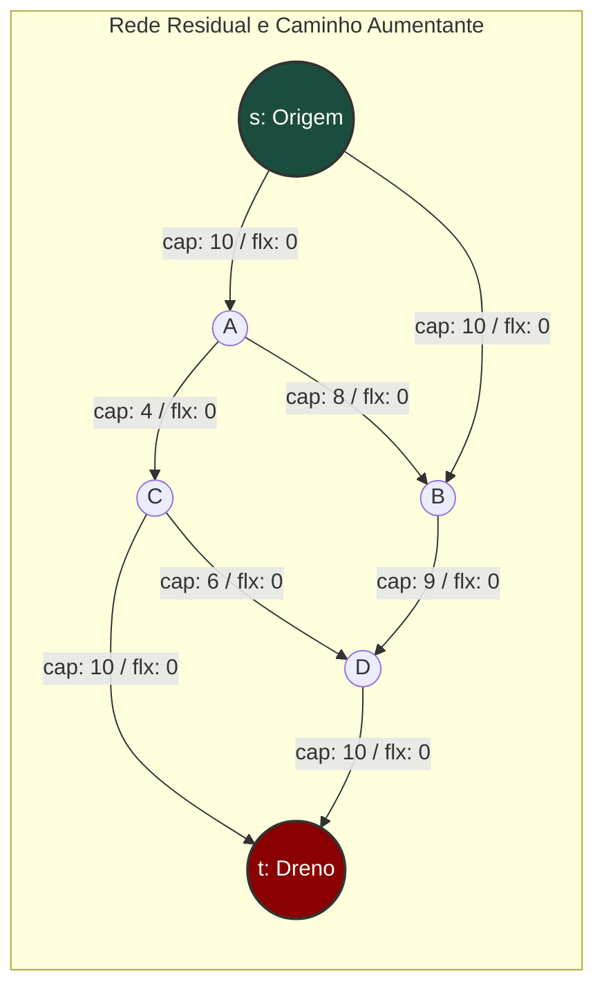
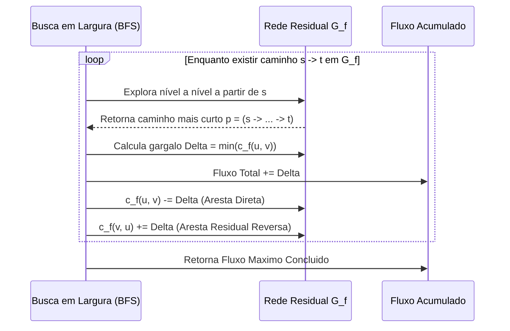
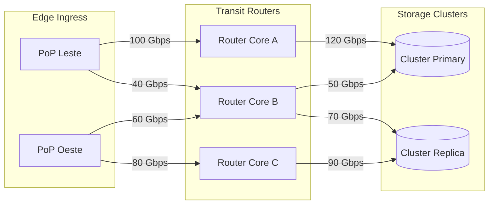

# 📖 Aula: Fluxo Máximo e Algoritmo de Edmonds-Karp

---

## 🎯 1. Visão Geral & Intuição do Problema

O problema do **Fluxo Máximo (Max-Flow)** modela o transporte sustentável de itens (bytes em fibra óptica, pacotes de rede, fluidos em tubulações ou tráfego de requisições em microsserviços) de uma fonte emissora (*source*, $s$) até um sumidouro receptor (*sink*, $t$), através de uma malha com restrições físicas de capacidade.

Em arquitetura de sistemas distribuídos, gargalos de vazão raramente ocorrem em nós isolados; eles emergem da interação topológica entre enlaces congestionados. Se roteamos tráfego de forma ingênua (usando apenas o caminho mais curto sem considerar capacidade residual), provocamos saturação prematura de links críticos enquanto rotas alternativas permanecem subutilizadas.

O algoritmo de **Edmonds-Karp** é a especialização prática e garantidamente polinomial do método de **Ford-Fulkerson**. Sua sacada central reside na escolha estratégica do caminho de aumento via **Busca em Largura (BFS)**, eliminando o risco de loops infinitos ou tempo de convergência dependente das magnitudes de capacidade.

---

## 📐 2. Fundamentação Teórica & Matemática

Uma rede de fluxo é um grafo direcionado $G = (V, E)$ onde cada aresta $(u, v) \in E$ possui uma capacidade não-negativa $c(u, v) \ge 0$. Se $(u, v) \notin E$, definimos $c(u, v) = 0$.

Existem dois vértices especiais: a fonte $s \in V$ e o dreno/sumidouro $t \in V$.

### Invariantes Fundamentais do Fluxo
Uma função de fluxo $f: V \times V \to \mathbb{R}$ é válida se e somente se respeitar três condições para todos $u, v \in V$:

1. **Restrição de Capacidade:**
   $$0 \le f(u, v) \le c(u, v)$$

2. **Antissimetria (Skew Symmetry):**
   $$f(u, v) = -f(v, u)$$

3. **Conservação de Fluxo:**
   $$\sum_{v \in V} f(u, v) = 0 \quad \forall u \in V \setminus \{s, t\}$$

O valor total do fluxo transportado $|f|$ é definido como o fluxo líquido que sai da fonte:
$$|f| = \sum_{v \in V} f(s, v)$$

### Rede Residual e Caminho Aumentante
Dada uma rede de fluxo e um fluxo atual $f$, a **capacidade residual** $c_f(u, v)$ de uma aresta é:
$$c_f(u, v) = c(u, v) - f(u, v)$$

Um **caminho aumentante** $p$ é um caminho simples de $s$ a $t$ na rede residual $G_f$, onde para toda aresta $(u, v) \in p$, temos $c_f(u, v) > 0$. A capacidade residual do caminho (gargalo) é:
$$c_f(p) = \min \{ c_f(u, v) : (u, v) \in p \}$$

### Teorema Max-Flow Min-Cut (Dualidade)
Um **corte $(S, T)$** particiona os vértices $V$ em $S$ e $T = V \setminus S$ tais que $s \in S$ e $t \in T$. A capacidade do corte é $c(S, T) = \sum_{u \in S, v \in T} c(u, v)$.

> **Teorema Fundamental:**
> O valor máximo de um fluxo $s$-$t$ é estritamente igual à capacidade mínima sobre todos os cortes $s$-$t$ em $G$:
> $$\max |f| = \min_{(S, T)} c(S, T)$$

---

## 🗺️ 3. Arquitetura Visual & Fluxo



### Mecânica de Aresta Residual (Backtracking de Fluxo)
Quando empurramos fluxo através da aresta $(u, v)$, a rede residual cria/aumenta automaticamente uma aresta reversa $(v, u)$ com capacidade residual igual ao fluxo alocado. Isso permite que iterações futuras "desfaçam" decisões subótimas.



---

## ⚙️ 4. Mecanismo Interno & Passo a Passo

O algoritmo executa as seguintes fases de forma determinística:

1. **Inicialização:**
   - Cria a matriz ou lista de capacidade residual $c_f$ idêntica à capacidade original $c$.
   - Inicializa o fluxo acumulado total como zero: $|f| = 0$.

2. **Busca do Menor Caminho em Número de Saltos (BFS):**
   - Inicia BFS a partir de $s$.
   - Mantém um vetor `parent[]` para reconstruir a trajetória percorrida.
   - Visita apenas vértices vizinhos $v$ onde a capacidade residual $c_f(u, v) > 0$.
   - Ao atingir o dreno $t$, interrompe a busca imediatamente.

3. **Determinação do Gargalo e Atualização Residual:**
   - Itera de $t$ até $s$ retrocedendo via `parent[]`:
     $$\Delta = \min_{(u, v) \in p} c_f(u, v)$$
   - Realiza uma segunda passagem para atualizar a malha:
     $$c_f(u, v) \leftarrow c_f(u, v) - \Delta$$
     $$c_f(v, u) \leftarrow c_f(v, u) + \Delta$$
   - Incrementa o fluxo total: $|f| \leftarrow |f| + \Delta$.

4. **Convergência:**
   - Quando a BFS não consegue alcançar $t$ (não há caminho com capacidade residual estritamente positiva), o algoritmo para. O valor retornado é matematicamente ótimo.

---

## 💻 5. Implementação de Referência (Linguagem C)

> [!NOTE]
> Implementação em **C99** com matriz de adjacência residual, focando em alocação contígua, ausência de overhead e clareza de ponteiros.

```c
#include <stdio.h>
#include <stdlib.h>
#include <stdbool.h>
#include <string.h>

#define MAX_VERTICES 256
#define INF 0x3F3F3F3F

typedef struct {
    int vertices;
    int capacity[MAX_VERTICES][MAX_VERTICES];
    int residual[MAX_VERTICES][MAX_VERTICES];
} FlowNetwork;

// Inicializa a rede com V vértices
void init_network(FlowNetwork *net, int v) {
    net->vertices = v;
    memset(net->capacity, 0, sizeof(net->capacity));
    memset(net->residual, 0, sizeof(net->residual));
}

// Adiciona aresta direcionada com capacidade
void add_edge(FlowNetwork *net, int u, int v, int cap) {
    net->capacity[u][v] += cap;
    net->residual[u][v] += cap; // residual inicial = capacidade
}

// BFS para encontrar o caminho aumentante mais curto em número de arestas
static bool bfs_find_path(const FlowNetwork *net, int source, int sink, int parent[]) {
    bool visited[MAX_VERTICES];
    memset(visited, false, sizeof(visited));

    int queue[MAX_VERTICES];
    int head = 0, tail = 0;

    queue[tail++] = source;
    visited[source] = true;
    parent[source] = -1;

    while (head < tail) {
        int u = queue[head++];

        for (int v = 0; v < net->vertices; v++) {
            // Condição do caminho aumentante: não visitado e com capacidade residual > 0
            if (!visited[v] && net->residual[u][v] > 0) {
                parent[v] = u;
                visited[v] = true;

                if (v == sink) {
                    return true; // Encontrou caminho até o dreno
                }
                queue[tail++] = v;
            }
        }
    }
    return false;
}

// Execução do algoritmo Edmonds-Karp
int edmonds_karp(FlowNetwork *net, int source, int sink) {
    int max_flow = 0;
    int parent[MAX_VERTICES];

    // Enquanto houver caminho aumentante na rede residual
    while (bfs_find_path(net, source, sink, parent)) {
        // 1. Determinar o gargalo (bottleneck capacity) do caminho encontrado
        int path_flow = INF;
        for (int v = sink; v != source; v = parent[v]) {
            int u = parent[v];
            if (net->residual[u][v] < path_flow) {
                path_flow = net->residual[u][v];
            }
        }

        // 2. Atualizar as capacidades residuais direta e reversa
        for (int v = sink; v != source; v = parent[v]) {
            int u = parent[v];
            net->residual[u][v] -= path_flow;
            net->residual[v][u] += path_flow; // Aresta reversa para backtracking
        }

        // 3. Acumular o fluxo
        max_flow += path_flow;
    }

    return max_flow;
}

int main(void) {
    FlowNetwork net;
    int v = 6;
    init_network(&net, v);

    // Vértices: 0=s, 1=A, 2=B, 3=C, 4=D, 5=t
    add_edge(&net, 0, 1, 10);
    add_edge(&net, 0, 2, 10);
    add_edge(&net, 1, 3, 4);
    add_edge(&net, 1, 2, 8);
    add_edge(&net, 2, 4, 9);
    add_edge(&net, 3, 5, 10);
    add_edge(&net, 4, 5, 10);
    add_edge(&net, 3, 4, 6);

    int max_flow = edmonds_karp(&net, 0, 5);
    printf("Fluxo Maximo Calculado: %d\n", max_flow);

    return 0;
}
```

---

## 💣 6. Gotchas, Edge Cases & Falhas em Produção

> [!WARNING]
> Em sistemas reais de larga escala, negligenciar o comportamento da rede residual gera falhas de performance e estouro de memória.

- **Ford-Fulkerson Ingênuo com DFS vs Edmonds-Karp:** Se as capacidades forem irracionais ou muito desproporcionais (ex: capacidades de $10^9$), o Ford-Fulkerson com DFS pode exigir $O(E \cdot |f|)$ iterações, alternando incrementalmente de 1 em 1. O Edmonds-Karp elimina esse problema ao usar BFS, limitando o número total de aumentos a $O(V \cdot E)$.
- **Arestas Bidirecionais e Paralelas:** Se existem arestas $u \to v$ e $v \to u$ com capacidades iniciais independentes, uma matriz ingênua pode sobrescrever $residual[v][u]$. Em listas de adjacência, cada aresta precisa guardar um ponteiro explícito para sua correspondente reversa (`edge->reverse`).
- **Capacidades com Ponto Flutuante (Erros de Precisão Numérica):** Evite `float` ou `double` para capacidades residuais. Erros de arredondamento de precisão (IEEE 754) podem fazer com que uma capacidade nunca chegue a exatamente zero, gerando loops infinitos. Utilize representação de inteiros escalados (Fixed-point arithmetic).
- **Densidade do Grafo e Cache Trashing:** Em grafos com milhares de nós esparsos, a matriz de adjacência consome $O(V^2)$ de memória e destrói o L1/L2 data cache com saltos contínuos. Use listas de adjacência encadeadas em vetores contíguos (Forward Star Representation).

---

## ⚖️ 7. Análise de Complexidade & Trade-offs

| Dimensão | Complexidade | Justificativa / Comportamento |
| :--- | :--- | :--- |
| **Tempo (Pior Caso)** | $\mathcal{O}(V \cdot E^2)$ | A distância de $s$ a qualquer vértice $v$ em $G_f$ é monotonicamente não-decrescente. Cada aresta se torna crítica no máximo $V/2$ vezes. Com BFS custando $\mathcal{O}(E)$, o limite é $\mathcal{O}(V E^2)$. |
| **Espaço (Memória)** | $\mathcal{O}(V^2)$ ou $\mathcal{O}(V + E)$ | $\mathcal{O}(V^2)$ para matriz de adjacência; $\mathcal{O}(V + E)$ se implementado com lista de adjacência/ponteiros reversos. |
| **Independência de Capacidade** | Sim | Ao contrário de Ford-Fulkerson genérico ($\mathcal{O}(E \cdot |f|)$), o tempo de execução é puramente combinatorial, não dependendo dos valores numéricos das capacidades. |

### Matriz Comparativa de Algoritmos de Fluxo:
- **Edmonds-Karp ($\mathcal{O}(VE^2)$):** Ideal para grafos pequenos/médios ou esparsos ($E \approx V$), simples de implementar e sem dependência de parâmetros externos.
- **Algoritmo de Dinic ($\mathcal{O}(V^2 E)$):** Constrói grafos de nível com BFS e empurra fluxos bloqueantes com DFS. É superior em quase todos os cenários práticos modernos.
- **Push-Relabel (Preflow-Push) ($\mathcal{O}(V^3)$ ou $\mathcal{O}(V^2 \sqrt{E})$ com heurística FIFO):** Mais eficiente para redes extremamente densas ($E \approx V^2$) e altamente paralelizável.

---

## 🏛️ 8. Desafio Arquitetural Aplicado (System Design)

### Cenário: Balanceamento de Banda em Gateway de Ingress / CDN Multi-PoP
Uma infraestrutura em nuvem global possui 8 Pontos de Presença (PoPs) receptores de tráfego de borda que precisam enviar terabytes por segundo de requisições analíticas para 4 clusters regionais de banco de dados, atravessando 12 links de trânsito intermediários com acordos de nível de serviço (SLA) e limites rígidos de largura de banda contratada (Gbps).



- **O Problema:** Durante eventos de pico de tráfego, links diretos saturam e geram descarte de pacotes (Packet Drop), embora a malha intermediária possua capacidade ociosa em caminhos não-diretos.
- **Solução Arquitetural:**
  1. O controlador de tráfego central (Software-Defined Networking - SDN Controller) coleta a topologia e as capacidades residuais a cada ciclo de 500ms.
  2. Constrói um modelo de super-fonte $S^*$ (conectada a todos os PoPs com capacidades iguais ao tráfego de entrada medido) e um super-dreno $T^*$ (conectado aos clusters com suas capacidades de processamento).
  3. Executa o cálculo de Fluxo Máximo na malha.
  4. Extrai a decomposição em caminhos de fluxo e reprograma as tabelas de roteamento OpenFlow/eBPF na borda com pesos proporcionais aos fluxos calculados, eliminando gargalos de forma ótima e automática.

---

## 🧠 9. Active Recall & Verificação Rápida

Responda mentalmente antes de encerrar o estudo desta unidade:

1. **Por que o uso de BFS garante a complexidade $\mathcal{O}(VE^2)$ enquanto a DFS pode degenerar para $\mathcal{O}(E \cdot |f|)$?**
2. **Qual é o papel fundamental das arestas reversas com capacidade residual na rede $G_f$? O que ocorreria se não as atualizássemos?**
3. **Pelo Teorema Max-Flow Min-Cut, como podemos identificar os links físicos exatos que constituem o gargalo que limita a capacidade do sistema inteiro?**
