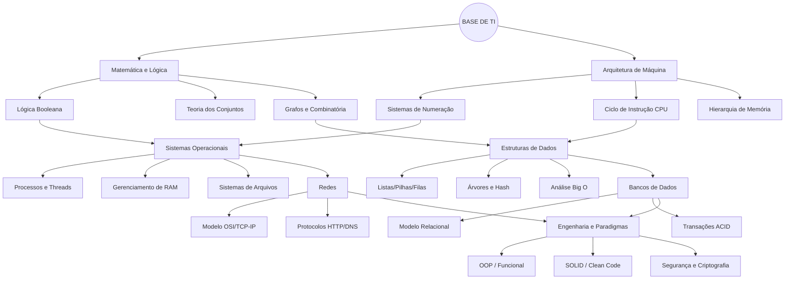

```mermaid
graph TD
    Root((BASE DE TI)) --> R1[Matemática e Lógica]
    Root --> R2[Arquitetura de Máquina]

    %% Galho de Lógica
    R1 --> L1[Lógica Booleana]
    R1 --> L2[Teoria dos Conjuntos]
    R1 --> L3[Grafos e Combinatória]
    
    %% Galho de Hardware
    R2 --> H1[Sistemas de Numeração]
    R2 --> H2[Ciclo de Instrução CPU]
    R2 --> H3[Hierarquia de Memória]

    %% O Tronco (Onde as coisas se unem)
    L1 & H1 --> TR[Sistemas Operacionais]
    L3 & H2 --> TR2[Estruturas de Dados]
    
    %% Galhos de Especialização Base
    TR --> SO1[Processos e Threads]
    TR --> SO2[Gerenciamento de RAM]
    TR --> SO3[Sistemas de Arquivos]

    TR2 --> ED1[Listas/Pilhas/Filas]
    TR2 --> ED2[Árvores e Hash]
    TR2 --> ED3[Análise Big O]

    %% Galhos de Comunicação e Persistência
    TR2 --> DB[Bancos de Dados]
    DB --> DB1[Modelo Relacional]
    DB --> DB2[Transações ACID]
    
    TR --> NET[Redes]
    NET --> NET1[Modelo OSI/TCP-IP]
    NET --> NET2[Protocolos HTTP/DNS]

    %% Copa da Árvore (Preparação para Arquitetura)
    NET & DB --> ENG[Engenharia e Paradigmas]
    ENG --> P1[OOP / Funcional]
    ENG --> P2[SOLID / Clean Code]
    ENG --> P3[Segurança e Criptografia]

```
